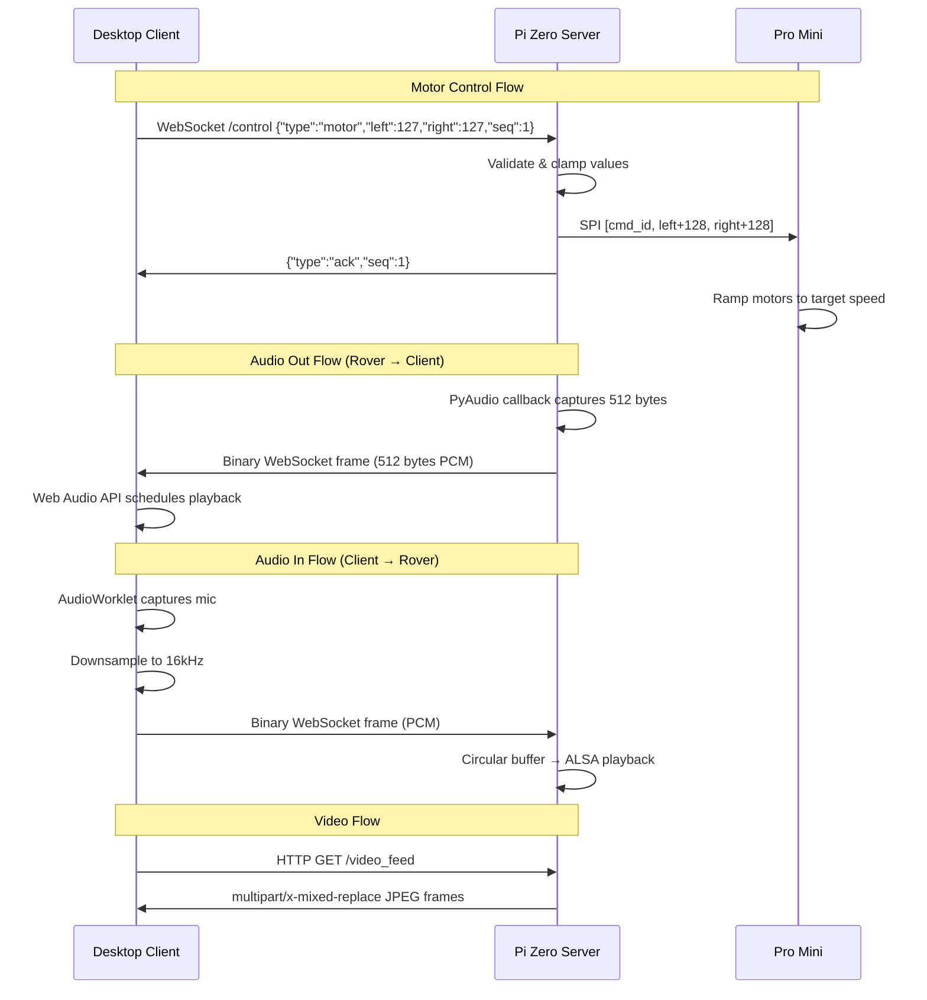
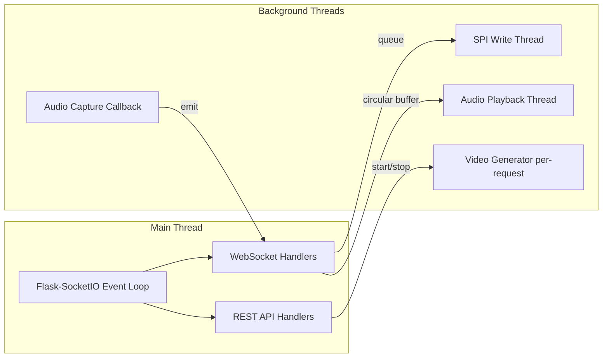

# Design Document: SMARS Telepresence Rover

## Overview

This design describes the unified SMARS telepresence rover system — a single-process Python server on a Raspberry Pi Zero W that merges motor control (SPI), webcam streaming (MJPEG over HTTP), bidirectional audio (binary WebSocket), and a REST configuration API into one Flask-SocketIO application. A Tauri desktop client provides the operator interface with keyboard-driven motor control, live video, and two-way audio.

The system prioritizes low latency for motor control (<50ms end-to-end), acceptable latency for audio (50-100ms), and simplicity of deployment on resource-constrained hardware (single process, ~35-50% CPU budget on Pi Zero W).

### Key Design Decisions

| Decision | Rationale |
|----------|-----------|
| Flask-SocketIO with threading async mode | Proven on Pi Zero from existing webcam streamer; simpler to debug than gevent |
| Binary WebSocket frames for audio | Eliminates hex-encoding overhead (2x bandwidth savings vs existing implementation) |
| Dedicated /control namespace | Isolates high-priority motor commands from audio/video traffic |
| HTTP MJPEG for video (not WebSocket) | Works natively with `` tags; browser handles buffering; simpler than WebSocket framing |
| Single Python process | Simplifies deployment, debugging, and resource management on Pi Zero |
| Tauri for desktop client | ~5MB binary vs ~150MB Electron; native mic access without HTTPS; vanilla HTML/CSS/JS frontend |
| SPI at 500kHz | 3-byte transfer takes ~48μs — non-blocking, no risk to event loop |

## Architecture

### System Architecture Diagram

```mermaid
graph TB
    subgraph Desktop["Desktop Client (Tauri)"]
        UI[HTML/CSS/JS Frontend]
        Motor[motor.js - Keyboard → Commands]
        Video[video.js - MJPEG Display]
        AudioOut[audio_out.js - Play Rover Audio]
        AudioIn[audio_in.js - Capture & Send Mic]
        App[app.js - Connection Manager]
    end

    subgraph PiZero["Raspberry Pi Zero W"]
        subgraph Server["Unified Python Server (port 8080)"]
            Main[main.py - Flask-SocketIO App]
            CtrlNS[/control Namespace]
            AudioOutNS[/audio_out Namespace]
            AudioInNS[/audio_in Namespace]
            VideoEP[/video_feed HTTP Endpoint]
            RestAPI[/api/* REST Endpoints]
            MC[motor_controller.py]
            AC[audio_capture.py]
            AP[audio_playback.py]
            VS[video_stream.py]
            DD[device_detector.py]
            Cfg[config.py]
        end
    end

    subgraph Arduino["Arduino Pro Mini (SPI Slave)"]
        FW[Firmware - Motor Ramping + Safety]
        L293D[L293D Motor Driver]
        OLED[SSD1306 OLED Display]
    end

    Motor -->|WebSocket /control| CtrlNS
    CtrlNS --> MC
    MC -->|SPI 500kHz| FW
    FW --> L293D
    FW --> OLED

    AudioOutNS -->|Binary PCM frames| AudioOut
    AC --> AudioOutNS

    AudioIn -->|Binary PCM frames| AudioInNS
    AudioInNS --> AP

    Video -->|HTTP GET| VideoEP
    VS --> VideoEP

    App -->|REST| RestAPI
    RestAPI --> DD
    RestAPI --> Cfg

```

### Communication Flow



### Threading Model



The server uses Flask-SocketIO's threading async mode. The main thread handles all WebSocket and HTTP events. Background threads handle:
- **SPI writes**: Motor commands are written to SPI from the WebSocket handler directly (48μs, non-blocking — no separate thread needed)
- **Audio capture**: PyAudio runs its own callback thread; captured data is emitted to connected clients
- **Audio playback**: A dedicated thread reads from a circular buffer and writes to ALSA
- **Video generation**: OpenCV capture runs as a Python generator, yielding JPEG frames per HTTP request

## Components and Interfaces

### Server Components

#### 1. main.py — Application Entry Point

**Responsibilities:**
- Create Flask app and SocketIO instance
- Register all namespaces and REST blueprints
- Initialize hardware interfaces (SPI, audio, video)
- Start the server on 0.0.0.0:8080

**Interface:**
```python
# Flask-SocketIO app creation
app = Flask(__name__)
socketio = SocketIO(app, async_mode='threading', cors_allowed_origins='*')

# Namespace registration
socketio.on_namespace(ControlNamespace('/control'))
socketio.on_namespace(AudioOutNamespace('/audio_out'))
socketio.on_namespace(AudioInNamespace('/audio_in'))

# HTTP routes
app.register_blueprint(api_blueprint, url_prefix='/api')
app.add_url_rule('/video_feed', 'video_feed', video_feed_route)
```

#### 2. motor_controller.py — SPI Motor Interface

**Responsibilities:**
- Open and configure spidev (bus 0, device 0, 500kHz, mode 0)
- Convert signed speed values to offset-encoded bytes
- Transmit 3-byte command packets
- Track command_id with wrapping at 255
- Handle SPI errors with single retry

**Interface:**
```python
class RoverController:
    def __init__(self, bus: int = 0, device: int = 0, speed_hz: int = 500000):
        """Initialize SPI connection. Raises RuntimeError if SPI unavailable."""

    def send_command(self, left: int, right: int) -> bool:
        """Send motor command. Returns True on success.
        left/right: -127 to 127 (clamped if out of range)
        """

    def stop(self) -> bool:
        """Send stop command (left=0, right=0)."""

    def close(self):
        """Release SPI resources."""

    @staticmethod
    def encode_speed(value: int) -> int:
        """Convert signed speed (-127..127) to offset byte (1..255)."""
```

#### 3. audio_capture.py — Microphone Capture

**Responsibilities:**
- Open PyAudio stream in callback mode (16kHz, mono, 16-bit)
- Buffer captured audio into 512-byte chunks
- Provide a callback mechanism to emit chunks to WebSocket clients
- Start/stop capture on demand

**Interface:**
```python
class AudioCapture:
    def __init__(self, device_index: int = None, sample_rate: int = 16000,
                 chunk_size: int = 256, on_audio: Callable[[bytes], None] = None):
        """Initialize audio capture. on_audio called with 512-byte PCM chunks."""

    def start(self):
        """Start capturing audio."""

    def stop(self):
        """Stop capturing and release resources."""

    @property
    def is_active(self) -> bool:
        """Whether capture is currently running."""
```

#### 4. audio_playback.py — Speaker Playback

**Responsibilities:**
- Open ALSA playback device (16kHz, mono, S16_LE, period 128)
- Maintain circular buffer (max 2 periods = 256 samples = 512 bytes)
- Run playback thread that reads from buffer and writes to ALSA
- Handle buffer overflow by discarding oldest data

**Interface:**
```python
class AudioPlayback:
    def __init__(self, device: str = 'default', sample_rate: int = 16000,
                 period_size: int = 128, max_periods: int = 2):
        """Initialize ALSA playback with circular buffer."""

    def start(self):
        """Start the playback thread."""

    def stop(self):
        """Stop playback and release resources."""

    def write(self, data: bytes):
        """Write PCM data to circular buffer. Discards oldest on overflow."""

    @property
    def buffer_level(self) -> int:
        """Current bytes in buffer."""
```

#### 5. video_stream.py — Video Capture and MJPEG Streaming

**Responsibilities:**
- Open OpenCV VideoCapture on configured V4L2 device
- Resize frames to configured resolution
- Encode frames as JPEG with configured quality
- Yield frames as a generator for Flask streaming response
- Maintain frame pacing (inter-frame delay based on target FPS)

**Interface:**
```python
class VideoStream:
    def __init__(self, device: int = 0, resolution: tuple = (320, 240),
                 fps: int = 10, jpeg_quality: int = 60):
        """Initialize video capture."""

    def start(self):
        """Open the video device."""

    def stop(self):
        """Release the video device."""

    def generate_frames(self) -> Generator[bytes, None, None]:
        """Yield MJPEG frames as multipart HTTP chunks."""

    @property
    def is_active(self) -> bool:
        """Whether video capture is running."""
```

#### 6. device_detector.py — Hardware Enumeration

**Responsibilities:**
- Enumerate V4L2 video devices via v4l2-ctl subprocess
- Enumerate ALSA audio devices via arecord subprocess
- Parse device capabilities (formats, resolutions, sample rates)
- Handle missing system tools gracefully

**Interface:**
```python
class DeviceDetector:
    @staticmethod
    def list_video_devices() -> list[dict]:
        """Return list of V4L2 devices with capabilities."""

    @staticmethod
    def list_audio_devices() -> list[dict]:
        """Return list of ALSA audio input devices with capabilities."""
```

#### 7. config.py — Server Configuration

**Responsibilities:**
- Define configuration dataclass with defaults
- Support runtime updates via REST API
- Validate configuration values

**Interface:**
```python
@dataclass
class ServerConfig:
    video_device: int = 0
    video_resolution: tuple = (320, 240)
    video_fps: int = 10
    video_jpeg_quality: int = 60
    audio_input_device: int = None  # None = default
    audio_sample_rate: int = 16000
    audio_chunk_samples: int = 256
    audio_playback_device: str = 'default'
    audio_period_size: int = 128
    audio_max_periods: int = 2
    spi_bus: int = 0
    spi_device: int = 0
    spi_speed_hz: int = 500000
    server_port: int = 8080
    server_host: str = '0.0.0.0'
```

### Client Components

#### 1. app.js — Connection Manager

**Responsibilities:**
- Manage Socket.IO connections to all namespaces
- Handle connect/disconnect events
- Implement exponential backoff reconnection
- Measure and display latency
- Coordinate start/stop of all subsystems

#### 2. motor.js — Motor Control

**Responsibilities:**
- Listen for keydown/keyup events (W, A, S, D, Space)
- Maintain key state (which keys are currently held)
- Send motor commands at 20Hz while movement keys are held
- Apply speed slider multiplier to base values
- Send stop command on all keys released
- Track sequence numbers for latency measurement

#### 3. video.js — Video Display

**Responsibilities:**
- Set/clear the MJPEG stream URL on the `` element
- Handle stream errors with placeholder display
- Start/stop video based on connection state

#### 4. audio_out.js — Rover Audio Playback

**Responsibilities:**
- Receive binary PCM frames from /audio_out namespace
- Create Web Audio API AudioContext at 16kHz
- Schedule buffer playback for gapless audio
- Manage playback enable/disable toggle

#### 5. audio_in.js — Local Mic Capture

**Responsibilities:**
- Capture local microphone via getUserMedia
- Process audio through AudioWorklet for downsampling to 16kHz
- Send binary PCM frames to /audio_in namespace
- Manage mic enable/disable toggle

## Data Models

### Motor Command Message (Client → Server)

```json
{
  "type": "motor",
  "left": 127,
  "right": 127,
  "seq": 42
}
```

| Field | Type | Range | Description |
|-------|------|-------|-------------|
| type | string | "motor" | Message type identifier |
| left | integer | -127 to 127 | Left motor speed (0 = stop) |
| right | integer | -127 to 127 | Right motor speed (0 = stop) |
| seq | integer | 0+ | Incrementing sequence number |

### Motor Acknowledgment (Server → Client)

```json
{
  "type": "ack",
  "seq": 42
}
```

### SPI Command Packet (Server → Arduino)

| Byte | Content | Encoding |
|------|---------|----------|
| 0 | command_id | 0-255, wrapping counter |
| 1 | left_speed | offset: value + 128 (1=full reverse, 128=stop, 255=full forward) |
| 2 | right_speed | offset: value + 128 |

### Audio Frame (Binary WebSocket)

- Format: Raw PCM, 16-bit signed little-endian, mono
- Sample rate: 16kHz
- Chunk size: 512 bytes (256 samples = 16ms of audio)
- Direction: Both /audio_out (server→client) and /audio_in (client→server)

### Device List Response (/api/devices)

```json
{
  "video": [
    {
      "path": "/dev/video0",
      "name": "USB Camera",
      "formats": ["MJPG", "YUYV"],
      "resolutions": ["320x240", "640x480"],
      "framerates": [10, 15, 30]
    }
  ],
  "audio": [
    {
      "device": "hw:1,0",
      "name": "USB Microphone",
      "formats": ["S16_LE"],
      "sample_rates": [16000, 44100, 48000],
      "channels": [1, 2]
    }
  ]
}
```

### Stream Status Response (/api/stream/status)

```json
{
  "video": {
    "active": true,
    "device": "/dev/video0",
    "resolution": "320x240",
    "fps": 10,
    "uptime_seconds": 342
  },
  "audio_capture": {
    "active": true,
    "device": "hw:1,0",
    "sample_rate": 16000
  },
  "audio_playback": {
    "active": true,
    "buffer_level": 256
  },
  "motor": {
    "spi_available": true,
    "last_command_ms_ago": 50
  }
}
```

### Server Configuration (/api/config)

```json
{
  "video": {
    "device": 0,
    "resolution": [320, 240],
    "fps": 10,
    "jpeg_quality": 60
  },
  "audio": {
    "input_device": null,
    "sample_rate": 16000,
    "chunk_samples": 256,
    "playback_device": "default",
    "period_size": 128,
    "max_periods": 2
  },
  "spi": {
    "bus": 0,
    "device": 0,
    "speed_hz": 500000
  },
  "server": {
    "port": 8080,
    "host": "0.0.0.0"
  }
}
```

### Circular Buffer State (audio_playback.py internal)

```
┌─────────────────────────────────────┐
│  Circular Buffer (max 512 bytes)    │
│  ┌───────┬───────┐                  │
│  │Period 0│Period 1│  (128 samples each = 256 bytes each)
│  └───────┴───────┘                  │
│  write_pos ──►                      │
│  read_pos  ──►                      │
│  On overflow: discard oldest period │
└─────────────────────────────────────┘
```
