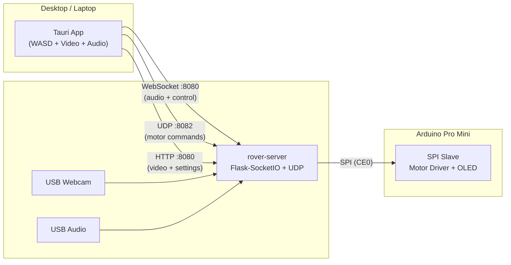

# SMARS Telepresence Rover

A WiFi-controlled telepresence rover built with a Raspberry Pi, Arduino Pro Mini, and a Tauri desktop client. Drive remotely with live video, bidirectional audio, and keyboard controls.

## Architecture



| Component | Role |
|-----------|------|
| `rover-server/` | Python server on the Pi — video streaming, audio, motor control via SPI |
| `rover-client/` | Tauri desktop app — WASD driving, live video, two-way audio |
| `rover-firmware/` | Arduino Pro Mini firmware — SPI slave, motor driver, OLED display |

## Hardware

- Raspberry Pi (3B+ or newer, with WiFi)
- Arduino Pro Mini 5V/16MHz
- L293D motor driver
- USB webcam (V4L2 compatible)
- USB audio adapter (mic + speaker)
- SSD1306 OLED display (I2C, 128x64)
- SMARS chassis with DC motors

## Quick Start

### 1. Flash the Arduino Firmware

Requires [PlatformIO](https://platformio.org/):

```bash
cd rover-firmware
pio run --target upload
```

This flashes the SPI slave firmware that receives motor commands from the Pi.

### 2. Set Up the Raspberry Pi Server

SSH into your Pi and clone the repo:

```bash
git clone https://github.com/robodude0395/rpi-smars-rover.git
cd rpi-smars-rover/rover-server
```

Enable SPI (required for motor control):

```bash
sudo raspi-config
# Interface Options → SPI → Enable
sudo reboot
```

Run the installer:

```bash
chmod +x install.sh
./install.sh
```

This will:
- Install system dependencies (OpenCV, PyAudio, ALSA, etc.)
- Create a Python virtual environment with all packages
- Set up **WiFi provisioning** (hotspot fallback for connecting to new networks)
- Install a **systemd service** so the rover server starts on boot

After installation, reboot:

```bash
sudo reboot
```

The rover server will start automatically on port 8080.

### 3. Build the Desktop Client

Requires [Node.js](https://nodejs.org/) 18+ and [Rust](https://rustup.rs/):

```bash
cd rover-client
npm install
npm run build
```

The built app is in `rover-client/src-tauri/target/release/`.

For development with hot-reload:

```bash
npm run dev
```

### 4. Connect and Drive

1. Launch the SMARS Rover desktop app
2. Enter the Pi's IP address (e.g. `192.168.1.50`)
3. Click **Connect**
4. Drive with WASD, adjust speed with the slider

## WiFi Provisioning

The rover includes a built-in WiFi provisioning system so you can take it anywhere without needing SSH or a monitor to configure WiFi.

**How it works:**

1. On boot, the Pi checks for a known WiFi network (waits up to 45s)
2. If no known network is found, it creates a hotspot: **SSID: `SMARS-Rover`**
3. Connect to `SMARS-Rover` from your phone or laptop
4. A captive portal opens (or browse to `http://10.42.0.1`)
5. Select a WiFi network, enter the password, hit Connect
6. The Pi joins that network and the hotspot shuts down

The Pi remembers networks — next time you're in range, it auto-connects without the hotspot.

## Services

After installation, two systemd services run on the Pi:

| Service | Purpose |
|---------|---------|
| `wifi_provision.service` | Checks WiFi on boot, starts hotspot if needed |
| `smars-rover.service` | Runs the rover server (`main.py`) |

Useful commands:

```bash
sudo systemctl status smars-rover          # Check server status
sudo journalctl -u smars-rover -f          # Tail server logs
sudo systemctl restart smars-rover         # Restart server
sudo systemctl status wifi_provision       # Check WiFi provisioning status
```

## Controls

| Key | Action |
|-----|--------|
| W | Forward |
| S | Backward |
| A | Turn left |
| D | Turn right |
| Space | Emergency stop |

Hold multiple keys for combined movement. Speed slider scales motor output 0–100%.

## Network Ports

| Port | Protocol | Service |
|------|----------|---------|
| 8080 | TCP | Flask-SocketIO (audio + settings + control) |
| 8082 | UDP | Motor commands (low-latency direct SPI bridge) |

## Project Structure

```
rpi-smars-rover/
├── rover-server/           # Raspberry Pi server
│   ├── main.py             # Entry point (multiprocess)
│   ├── config.py           # Hardware/network configuration
│   ├── motor_udp.py        # UDP → SPI motor bridge
│   ├── audio_capture.py    # Mic capture (Pi → client)
│   ├── audio_playback.py   # Speaker playback (client → Pi)
│   ├── install.sh          # One-command Pi setup
│   └── wifi_provision/     # WiFi hotspot provisioning
├── rover-client/           # Tauri desktop app
│   ├── src/                # HTML/CSS/JS frontend
│   └── src-tauri/          # Rust/Tauri backend
└── rover-firmware/         # Arduino Pro Mini firmware
    └── src/main.cpp        # SPI slave + motor control + OLED
```

## Troubleshooting

**Can't connect to rover:**
- Verify the Pi is on the same network: `ping <pi-ip>`
- Check the server is running: `sudo systemctl status smars-rover`
- Ensure port 8080 isn't blocked

**Motors not responding:**
- Verify SPI is enabled: `ls /dev/spidev0.0`
- Check Arduino is powered and SPI wires are connected
- Look for SPI errors in logs: `sudo journalctl -u smars-rover | grep SPI`

**No video:**
- Check webcam is connected: `v4l2-ctl --list-devices`
- Verify permissions: `ls -la /dev/video*`

**WiFi provisioning hotspot doesn't appear:**
- Wait 45+ seconds after boot
- Check service: `sudo systemctl status wifi_provision`
- View logs: `sudo journalctl -u wifi_provision`

## License

MIT
